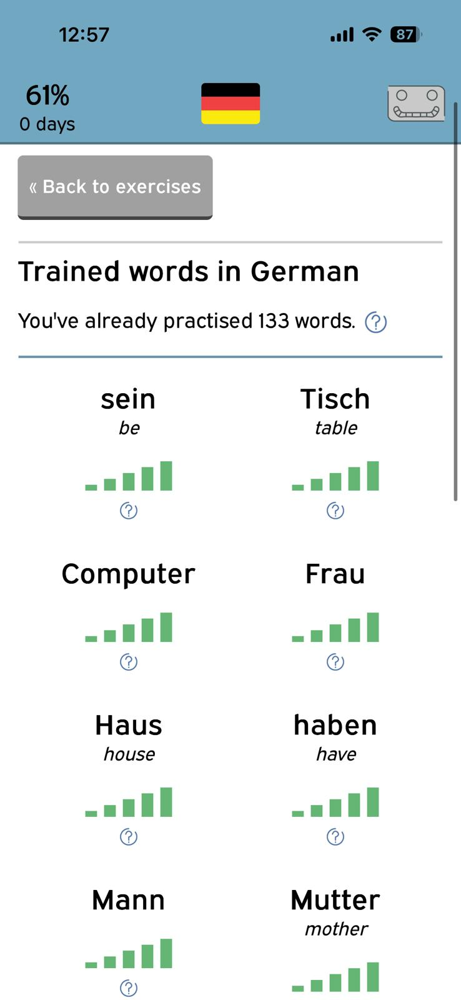

# Langauto – Interactive Grammar and Vocabulary App

**Live demo:** [https://langauto.camk.net](https://langauto.camk.net)

*(Free to use – create an account and start practising right away!)* 😄

---

## About

Langauto is a **web application for practising grammar and vocabulary** in multiple languages.
Originally created as a study tool for Latin, it has since been expanded to support multiple languages, such as **English, Portuguese German, Dutch, and Scottish Gaelic** (not all these languages are publicly available at the moment).

The app is designed for learners who want to practise grammar structures and expand their vocabulary through **interactive exercises**, accessible anytime on desktop or mobile. Unlike AI-generated content, the exercises are based on carefully pre-defined structures and vocabulary aligned with the CEFR levels for each language.

---

## Features

* 📱 **Cross-platform** – Works on PC and mobile devices. On iOS, it can be saved to the home screen and used like a native app (without push-notifications).
* 🎯 **Personalised exercises** – Select activities by **CEFR level** (A1–C2) to match your learning goals.
* 📖 **Grammar support** – Each exercise includes **learning aids and explanations** to help you understand the rules and then train them right away.
* 🗂️ **Personal dictionary** – Tracks your vocabulary, showing progress and frequency of mistakes for each word.
* 🔁 **Targeted repetition** – Encourages efficient learning by repeating words that were answered incorrectly.
* 🌐 **Free and accessible** – Exercises are free to use, without any ads.

---

## FAQ

**Does Langauto offer courses?**
No – it is not a course platform. Instead, it provides exercises and grammar explanations that you can use for independent study.

**What languages are available?**
Currently, only exercises in English (A1), German (A1, A2, B2, C1), and Brazilian Portuguese (A1) are publicly available. You can choose a course when you sign up, and later add more languages. The language of the system can also be switched (between BR Portuguese and English).

**Are there any usage limits?**
No – you can practise as much as you like.

**Do I have to pay?**
No – the platform is free to use. There are no ads at the moment.

**What are the levels?**
Exercises follow the **Common European Framework of Reference for Languages (CEFR):** A1, A2, B1, B2, C1, C2.

**Is my data safe?**
Yes – your registration data is stored securely and never shared with third parties. You can also delete your account at any time, and all associated data will be permanently removed from our servers

---

## Technology

Built with:

* **HTML, CSS, PHP, MySQL, jQuery**
* Designed for both desktop browsers and mobile (iOS home screen support).

---

## Screenshots

### Mobile Views

<table>
  <tr>
    <td align="center">
       
      Login screen for mobile devices
    </td>
    <td align="center">
       
      Interactive grammar or vocabulary exercise
    </td>
    <td align="center">
       
      Dashboard for German A1 course
    </td>
  </tr>
  <tr>
    <td align="center">
       
      Grammar help and explanations
    </td>
    <td align="center">
       
      Personal dictionary and progress tracker
    </td>
    <td align="center">
       
      Options and settings menu
    </td>
  </tr>
</table>

### Desktop Views

<table>
  <tr>
    <td align="center">
       
      Settings page on desktop
    </td>
  </tr>
</table>

---

## Try It Out

👉 Visit [https://langauto.camk.net](https://langauto.camk.net)

Sign up for free, explore the exercises, and start practising!

---

## Repository Notes

This repository serves as a **showcase only**. The source code is not public, as development is ongoing.

Future updates and improvements are planned.
